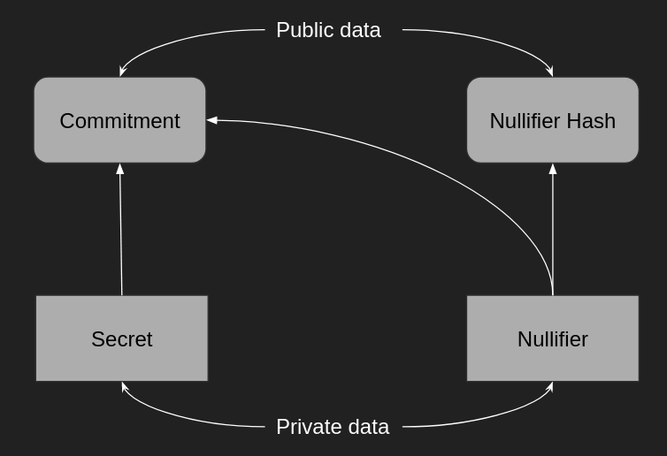

# Anonymous transfer

This implementation is a PoC project to learn and build a stack of how ZKP works in practice.

An [excellent article](https://www.linkedin.com/feed/update/urn:li:activity:7101936040877174784?updateEntityUrn=urn%3Ali%3Afs_feedUpdate%3A%28V2%2Curn%3Ali%3Aactivity%3A7101936040877174784%29) was written on this topic, illustrating the basic principles and a small amount of history.

# Theory

## "Zero-knowledge" proving system

A zero-knowledge proving system is a cryptographic tool that allows a prover to demonstrate that:

* She (Alice) knows a secret (a secret will be a value or a few values)
* She used those secret values inside a defined and known computation
* She performed that computation

Furthermore, let her prove all the above without revealing the original secret.
The proof also needs to have some specific positive features (be short, quick to verify)

## Practical example

1. Alice has two snooker balls, a black one and a white one.
2. She knows a secret: the black one is lighter than the white one.
3. She wants to prove to Bob that she knows this secret without revealing any information about it
4. She puts two balls into the bag and asks Bob to name the colour
5. If he says white, she holds up the heaviest; if he says black, the lightest
6. She repeats the process until Bob is convinced that she knows how to identify the correct ball

## ZKP core

As we move on, we need to understand the properties that need to be respected by our proof /proving system:
1. Soundness. It means that Alice cannot cheat.
2. Completeness. It means that each possibility has a way to be proven.
3. Zero-Knowledge. It means that the only statement disclosed is the one being proven.

# Problem

Imagine a situation where Alice wants to transfer one ETH to Bob anonymously, i.e., in a way that makes it impossible
to identify the source and recipient of the transfer.

# Solution

One of the possible solutions is to use ZKP of inclusion to hide a transfer in a set of other transfers.

> we need high user activity on the core contract to achieve anonymity.

## How it works

1. Alice generates secrets (two big random numbers: secret and nullifier) and commitment.
2. Deposits one ETH and sends commitment to the core contract.
3. Retrieves a contract stay to be able to generate a ZKP.
4. Generates ZKP of action (deposit).
5. Send the proof offline to an account unrelated to Alice but controlled by Alice or someone who has agreed with Alice
6. Withdraws one ETH by convincing the contract (verifier) that some action happened and she is eligible to withdraw funds.
7. Contract uses the nullifier hash provided with withdrawal to "nullify" the commitment. (Prevents double spending)

## Acknowledgments

* [Zero-Knowledge: A Breathtaking Journey](https://www.zeroknowledgeblog.com/)
